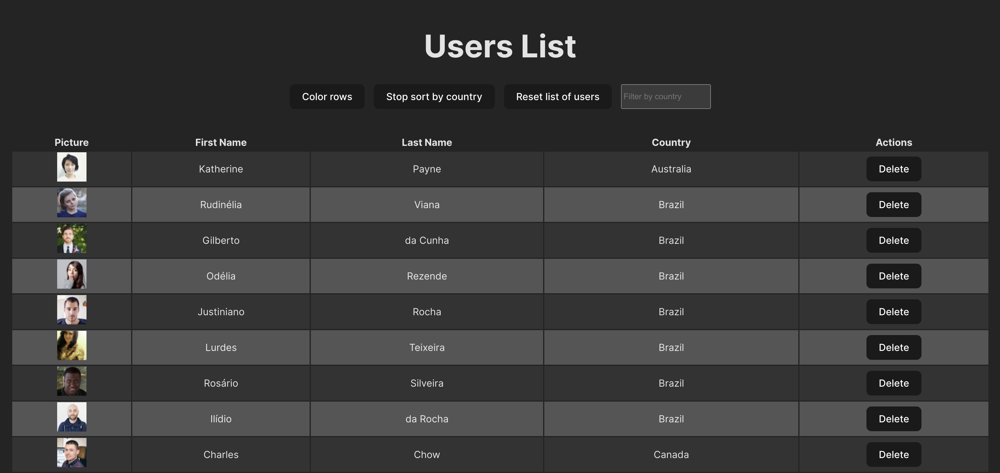
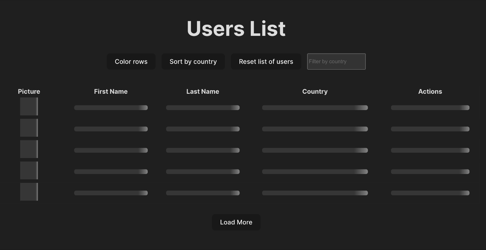
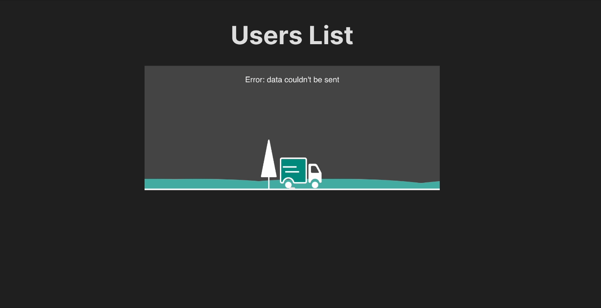
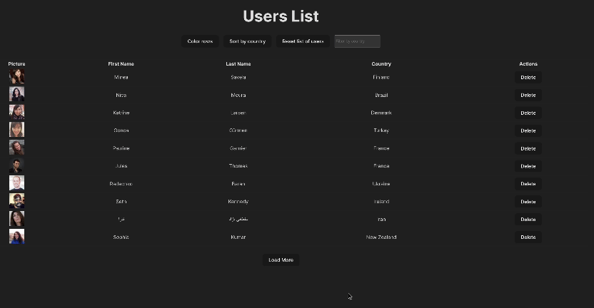

# User administrator panel.

This projects consist in an administrator panel where users user information is displayed. It's a technical assignment for a Semi-senior position.

To develop this app i've used the API provided by <a href='https://randomuser.me/'>Random User Generator</a>.

The steps followed for developing this:

<ol>
<li>Fetch 100 rows of data from API, and display it in a table format.</li>
<li>Button to color rows based on their positioning, even rows must have one color, and odd another.</li>
<li>Button to sort table by country.</li>
<li>Button to delete a user.</li>
<li>Feature to restore initial state without calling the API.</li>
<li>Feature to filter data by country using an input element.</li>
<li>Optimize code in order that any unnecessary doesnt get executed, for example avoid sorting when coloring rows.</li>
<li>Sort columns alphabetically when clicking on headers.</li>
</ol>

After finishing this assessment, by completing the items listed above, i decided to implement more features into this project, with the objective of improving app UX.

- Added loading skeletons and error animations, when connection to DB cant be stablish.

- Used <a href='https://tanstack.com/query/latest'>TanStack Query</a> for asynchronous state managing and implemented infinite scrolling.

